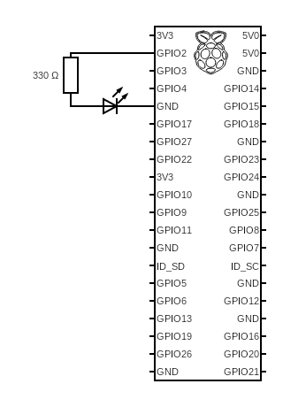

# Project Scope

The goal of this project is to create a device capable of listening to conversations around itself and recognise if the language(s) spoken during the conversation are English or French.

# Hardware setup

## RaspBerry Pi

Originally, the project was meant to be realised using an [Arduino Nano 33 Ble Sense](http://store-usa.arduino.cc/products/arduino-nano-33-ble-sense).
However, this has proven to be a highly limited aproach.

Therefore, the main body of the device will be a [RaspBerry Pi 4](https://www.raspberrypi.com/products/raspberry-pi-4-model-b/) instead.
The Raspberry Pi must be installed with 64-bit Raspbian OS. This is crucial as a 32-bit OS won't be able to properly run the current version of TensorFlow Lite.

The installation of the OS can be easily done using [Raspberry pi imager](https://www.raspberrypi.com/software/).

Once the operating system is functionnal, the raspberry can be installed with the [TensorFlow Lite](https://www.tensorflow.org/lite/guide) library using [this](https://pimylifeup.com/raspberry-pi-tensorflow-lite/) tutorial.

## The microphone

We are planning to use a [KY-038 High Sensitivity Microphone](https://roboeq.ir/files/id/3882/name/KY-037.pdf/) as the input for the device.

This chip unfortunatelly relies on an analog output which can not be directly read by the Raspberry's digital input pins.
Because of this, we will use an ADC (Analog to Digital Converter).

The original documentation of the KY-038 recommends the usage of a [KY-053](https://joy-it.net/en/products/COM-KY053ADC) ADC. Instructions to set up the KY-053 alongside the KY-038 can be found [here](https://sensorkit.joy-it.net/fr/sensors/ky-038).

## The LEDs

The ledss will be directly connected to the GPIO (General Purpose Input Output) pins of the Raspberry pi.
This specification will only describe how to connect a single LED.
Further LEDs can be connected in the exact same manner to consecutive GPIOs.

The exact GPIOs the LEDs will need to be connected to is left to the discretion of technician who assembles the setup.

Without the usage of extra equipment, each LED will need to be connected to a different GPIO to allow for separated controls.
Each LED must also be connected to their own resistor (preferably 300Ohm).
Every LED can however be connected to the same Ground pin.

Detailed tutorials can be found [here](https://www.instructables.com/Controlling-Multiple-LEDs-With-Python-and-Your-Ras/) and [here](https://thepihut.com/blogs/raspberry-pi-tutorials/27968772-turning-on-an-led-with-your-raspberry-pis-gpio-pins).

# Software

## Dataset

## Tensorflow model

## Recording audio with Raspb

## Running the model on Raspb

## Connecting to LEDs

## Web Interface
Using Flask and Python, we created a web interface to display in percent the predictions of the spoken language(s). It will be use during our oral exam of this project in order to have a better visualisation of the results.
This web interface needs to be link with the predictions code to get the predicted values.